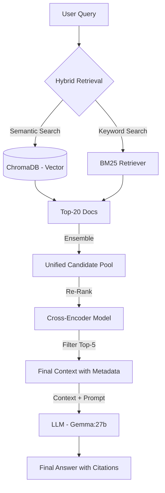

# 🚀 Advanced Hybrid RAG System with Citation & Re-ranking

## 🌟 Project Overview

This project represents a **production-ready RAG (Retrieval-Augmented Generation) architecture**. It evolves beyond standard vector search by implementing **Hybrid Search (BM25 + Dense Retrieval)**, **Cross-Encoder Re-ranking**, and **Strict Source Citation**.

The system is designed to handle **Multilingual (Turkish/English)** queries, complex **Multi-Hop reasoning**, and high-precision technical Q&A without hallucinations.

---

## 🔥 Key Features & Upgrades

| Feature | Description | Status |
| :--- | :--- | :--- |
| **Hybrid Search** | Combines **BM25 (Keyword)** and **ChromaDB (Semantic)** search via `EnsembleRetriever` to capture both exact terminology and conceptual meaning. | ✅ **Active** |
| **Source Citation** | The LLM explicitly cites sources for every claim (e.g., `[Source: document.pdf]`), ensuring transparency and trust. | ✅ **Active** |
| **Re-ranking** | Uses a **Cross-Encoder** (`ms-marco-TinyBERT`) to score and filter the top retrieved documents, significantly boosting precision. | ✅ **Active** |
| **Smart Ingestion** | The database script checks existing IDs to prevent duplicate embeddings, optimizing cost and speed during updates. | ✅ **Active** |
| **Multilingual** | Optimized for both Turkish and English using `paraphrase-multilingual-mpnet-base-v2`. | ✅ **Active** |

---

## 🏗️ Architecture

The system uses a "Retrieve & Re-rank" pipeline enhanced with Hybrid Search logic.



The final architecture is heavily optimized in the Retrieval phase to maximize the likelihood of fetching all necessary context pieces for complex synthesis. 

### System Components

| Component | Detail | Model / Tool | Rationale |
| :--- | :--- | :--- | :--- |
| **Vector Database** | Persistent data storage for vector similarity search. | **ChromaDB** (Running on Docker) | Provides a scalable, high-speed backbone for the Retrieval process. |
| **Embedding Model** | Converts text (Turkish/English) into vector representations. | **`paraphrase-multilingual-mpnet-base-v2`** | Ensures accurate **semantic matching** for multilingual queries (Turkish & English). |
| **Re-ranker** | Fine-tunes relevance scoring to filter noise from initial retrieval results. | **`cross-encoder/ms-marco-TinyBERT-L-2`** | Increases Retrieval **Precision** by focusing the LLM on the most salient chunks. |
| **LLM (Generator)** | Performs synthesis, reasoning, and final answer generation. | **Gemma:27b** (Running via Ollama) | Offers superior **Multi-Hop reasoning** power and context management. |
| **Dataset** | Clean, structured data for robust testing. | SQuAD and SQuAD-TR (JSON format) | Enables quantifiable testing of Grounding and inference capabilities. |

---
## 📂 Project Structure
.
├── database/                   # SQuAD JSON files & Source Documents
├── croma_db_update.py          # Smart Ingestion: Vectors (Chroma) + Keywords (BM25)
├── hybrid_reranking_rag.py     # MAIN SCRIPT: Hybrid Search + Rerank + Citation
├── native_rag.py               # Legacy Script: Standard Vector Search (for comparison)
├── requirements.txt            # Python dependencies
└── README.md

## 🛠️ Optimization Details

1. Hybrid Search (The "Pauli Principle" Effect)
Standard vector search often fails on specific technical terms (e.g., "Pauli exclusion principle") if the semantic embedding is too generic.

Solution: We use EnsembleRetriever (Weights: 0.5 Vector / 0.5 BM25).

Result: BM25 catches exact keywords, while Chroma catches the semantic meaning.

2. Strict Citation Prompting
To prevent hallucinations, the prompt is engineered to treat the context as the only source of truth.

Mechanism: Context chunks are injected with headers: [Source: filename | title].

Instruction: "When answering, you MUST cite the source filename."

3. Smart Database Update
croma_db_update.py now includes logic to skip already indexed documents:

ChromaDB: Skips existing IDs (Prevents disk bloat).

BM25: Always re-indexes in memory (Required for statistical accuracy).

### Optimization Summary Table

| Method / Technique | Challenge Addressed | Key Success |
| :--- | :--- | :--- |
| **Cross-Encoder Re-ranking** | Low-quality results from basic similarity search. | Selects only the **TOP_K_RERANK=10** most relevant chunks to send to the LLM. |
| **Aggressive Retrieval Tuning** | Missing context pieces (Multi-Hop failures). | Uses high K values (**TOP_K\_RETRIEVAL=30**) and large `chunk_size=2000` to ensure completeness. |
| **Multilingual Alignment** | Turkish queries failing on English-centric models. | Switched to **MPNet-based Multilingual** models for robust cross-lingual retrieval. |
| **Strict Prompt Engineering** | LLM Hallucination and Over-interpretation. | Implemented a strict **English instruction set** with a **"MUST answer in the SAME LANGUAGE as the question"** rule. |
| **Data Batching** | Failure to load large datasets into the Vector DB. | Implemented batching logic to respect ChromaDB's maximum upload limits. |

---

## ⚙️ Running the Project

### Prerequisites

1.  **Docker:** Required for running the ChromaDB server.
2.  **Ollama:** Required for running the Gemma:27b model locally (`ollama pull gemma:27b`).

### 1. Environment Setup

Install all necessary Python dependencies:

```bash
pip install -r requirements.txt
```
### 2. Ingest Data (Smart Update)

Loads your JSON/PDF data into ChromaDB.

```bash
# a) Start the ChromaDB Docker Container
docker run -d -p 8000:8000 chromadb/chroma

# b) Run the Update script to load and vectorize data (Run once initially)
python croma_db_update.py

```
Output: ⏭️ Atlanan (Zaten Var): 46106 (Shows efficient skipping of existing data).

### 3. Execute Queries

Run the main script to connect to the optimized database and execute the RAG test queries:

```bash
python native_rag.py
```
or Execute the main script to query with Hybrid Search and Citations.
```bash
python hybrid_reranking_rag.py
```

### 🔬 Performance & Citation Examples
TThe following results demonstrate the system's ability to provide accurate, grounded answers with citations.

🇹🇷 Turkish Test (Complex Inference)
Query: "Normanların eski İskandinav dinini ve dilini bırakıp... adaptasyon süreci nasıldı?"

✅ Gemma Response: Rollo'nun Vikinglerinin torunları ve Frenk eşleri İskandinav dinini ve Eski İskandinav dilini Katoliklik (Hıristiyanlık) ve yerel halkın Gallo-Romance dilinin yerini alacaktı... ([Source: squad-tr-dev-v1.0.0-excluded.json | Normanlar]). Sonunda Normanlar diller ve gelenekleri birleştirerek yerlilerle birleşti ([Source: squad-tr-dev-v1.0.0-excluded.json | Normanlar]).

🇺🇸 English Test (Specific Physics Terminology)
Query: "Why are non-conservative forces like friction considered results of microscopic potentials?"

✅ Gemma Response: Friction is a manifestation of the electromagnetic force acting between atoms of two surfaces and the Pauli exclusion principle that does not allow atoms to pass through each other ([Source: squad-tr-dev-v1.0.0-excluded.json | Kuvvet]). It is generally impossible to model these forces as gradients of potentials... ([Source: squad-tr-dev-v1.0.0-excluded.json | Kuvvet]).

(Note: The Hybrid system successfully retrieved the "Pauli exclusion principle" keyword, which the standard vector search missed.)

### 📊 Performance Comparison

| Metric | Native RAG (Vector Only) | Hybrid RAG (Vector + BM25) |
| :--- | :--- | :--- |
| **Technical Precision** | ⭐⭐⭐ (Good) | ⭐⭐⭐⭐ (Excellent) |
| **Citation Capability** | ❌ No | ✅ Yes |
| **Retrieval Method** | Similarity Search | Ensemble (Sparse + Dense) |
| **Handling Specific Terms** | Moderate | High (Thanks to BM25) |

### 📈 Conclusion: Performance Validation

The final results confirm the success of the optimization strategy:

Retrieval Precision: The system correctly identified and ranked the specific, highly technical Turkish context required to answer the force-related question (previously failed).

Multi-Hop Synthesis: Complex questions (e.g., Norman adaptation, metric terms) were successfully synthesized from multiple pieces of information within the context.

Grounding: The LLM adhered to the "answer only from context" rule, as evidenced by the correct technical answer and the concluding remark on the final physics question: "Ancak, verilen bağlam bu konuyu tam olarak açıklamıyor." (This demonstrates the model's self-assessment and compliance with the prompt limitations.)
