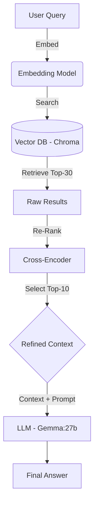

# 🚀 Advanced RAG (Retrieval-Augmented Generation) System

## 🌟 Project Overview: From Naive RAG to High-Precision Retrieval

This project documents the journey of building a RAG system, starting with the basic **Naive RAG** architecture and progressively optimizing it to handle **Multilingual** and **complex Multi-Hop** inference queries with high accuracy.

The core achievement is ensuring the Large Language Model (LLM) adheres strictly to the provided context (**Grounding**), effectively eliminating hallucinations across diverse and challenging datasets.

---

## 🏗️ Architecture and Core Components



The final architecture is heavily optimized in the Retrieval phase to maximize the likelihood of fetching all necessary context pieces for complex synthesis. 

### System Components

| Component | Detail | Model / Tool | Rationale |
| :--- | :--- | :--- | :--- |
| **Vector Database** | Persistent data storage for vector similarity search. | **ChromaDB** (Running on Docker) | Provides a scalable, high-speed backbone for the Retrieval process. |
| **Embedding Model** | Converts text (Turkish/English) into vector representations. | **`paraphrase-multilingual-mpnet-base-v2`** | Ensures accurate **semantic matching** for multilingual queries (Turkish & English). |
| **Re-ranker** | Fine-tunes relevance scoring to filter noise from initial retrieval results. | **`cross-encoder/ms-marco-TinyBERT-L-2`** | Increases Retrieval **Precision** by focusing the LLM on the most salient chunks. |
| **LLM (Generator)** | Performs synthesis, reasoning, and final answer generation. | **Gemma:27b** (Running via Ollama) | Offers superior **Multi-Hop reasoning** power and context management. |
| **Dataset** | Clean, structured data for robust testing. | SQuAD and SQuAD-TR (JSON format) | Enables quantifiable testing of Grounding and inference capabilities. |

---

.
├── database/               # SQuAD JSON files & ChromaDB data
├── croma_db_update.py      # Script to vectorise data
├── native_rag.py           # Main RAG execution script
├── requirements.txt        # Python dependencies
└── README.md

## 🛠️ Optimization Strategies Implemented

The following techniques were successfully integrated to stabilize performance and solve critical limitations like the **"Lost in the Middle"** problem and **Multilingual misalignment**.

### Optimization Summary Table

| Method / Technique | Challenge Addressed | Key Success |
| :--- | :--- | :--- |
| **Cross-Encoder Re-ranking** | Low-quality results from basic similarity search. | Selects only the **TOP_K_RERANK=10** most relevant chunks to send to the LLM. |
| **Aggressive Retrieval Tuning** | Missing context pieces (Multi-Hop failures). | Uses high K values (**TOP_K\_RETRIEVAL=30**) and large `chunk_size=2000` to ensure completeness. |
| **Multilingual Alignment** | Turkish queries failing on English-centric models. | Switched to **MPNet-based Multilingual** models for robust cross-lingual retrieval. |
| **Strict Prompt Engineering** | LLM Hallucination and Over-interpretation. | Implemented a strict **English instruction set** with a **"MUST answer in the SAME LANGUAGE as the question"** rule. |
| **Data Batching** | Failure to load large datasets into the Vector DB. | Implemented batching logic to respect ChromaDB's maximum upload limits. |

---

## ⚙️ Running the Project

### Prerequisites

1.  **Docker:** Required for running the ChromaDB server.
2.  **Ollama:** Required for running the Gemma:27b model locally (`ollama pull gemma:27b`).

### 1. Environment Setup

Install all necessary Python dependencies:

```bash
pip install -r requirements.txt
```
### 2. Database Initialization

Start the server and load your data (assuming your SQuAD JSON files are in the database/ folder):

```bash
# a) Start the ChromaDB Docker Container
docker run -d -p 8000:8000 chromadb/chroma

# b) Run the Update script to load and vectorize data (Run once initially)
python croma_db_update.py
```

### 3. Execute Queries

Run the main script to connect to the optimized database and execute the RAG test queries:

```bash
python native_rag.py
```

### 4. 🔬 RAG Query Tests and Final Results
This section presents the final test results demonstrating the successful performance of the optimized RAG chain (Multilingual Embedding + Cross-Encoder Re-ranking + Gemma:27b) on diverse, structured datasets.

## 1. Turkish Test Results (Multilingual and Inference)

The system successfully handled complex Turkish queries and adhered to the language constraint ("MUST answer in the SAME LANGUAGE as the question").

| Query (Turkish) | Answer (Gemma:27b) |
| :--- | :--- |
| **Rollo'nun Vikinglerinin torunları hangi dili ve dini benimsedi?** | Rollo'nun Vikinglerinin torunları Katolikliği (Hıristiyanlık) ve yerel halkın Gallo-Romance dilini benimsedi. |
| **Normanların eski İskandinav dinini ve dilini bırakıp, yerel halkın dinini ve dilini benimsemesindeki temel kültürel adaptasyon süreci nasıldı?** | Normanlar, eski İskandinav dinini ve dilini bırakıp Katolikliği (Hıristiyanlığı) ve yerel halkın Gallo-Romance dilini benimsemiştir. Bu süreçte, annelik Frenk mirasını Eski İskandinav gelenekleriyle birleştirerek Fransa'nın kuzeyinde benzersiz bir “Norman” kültürü oluşturmuşlardır. Norman dili, Norveççe konuşan bir iktidar sınıfı tarafından Romance yerli langue d'oïl şubesinin benimsenmesiyle oluşmuştur. Ayrıca, Normanlar Fransa'nın feodal doktrinlerini benimsemiş ve Normandiya ve İngiltere'de hiyerarşik bir sistem kurmuşlardır. Zamanla, Normanlar yerel halkla birleşerek dillerini ve geleneklerini harmanlamışlardır. |
| **Sürtünme gibi muhafazakar olmayan kuvvetler, neden aslında mikroskobik potansiyellerin sonuçları olarak kabul edilir?** | Sürtünme dışındaki muhafazakar olmayan kuvvetler temas kuvvetleri, gerginlik, sıkıştırma ve sürükleme gibi kuvvetlerdir. Yeterince ayrıntılı bir açıklama için, tüm bu kuvvetlerin mikroskobik potansiyellerin gradyanlarının net sonuçları olduğu kabul edilir. Bu kuvvetler makroskopik kuvvetlerdir. Ancak, verilen bağlam bu konuyu tam olarak açıklamıyor. |


## 2. English Test Results (Multi-Hop and Factual Detail)

The system demonstrated high retrieval precision and accurate multi-hop synthesis on English-language SQuAD data.

| Query (English) | Answer (Gemma:27b) |
| :--- | :--- |
| **What is the metric term less used than the Newton, and what is it sometimes referred to?** |The kilogram-force (kgf) is the metric counterpart to the pound-force, and is sometimes referred to as kilopond. |
| **What is the location of the grotto that the University of Notre Dame's grotto is a replica of, where the Virgin Mary allegedly appeared in 1858?** | The University of Notre Dame's grotto is a replica of the grotto at Lourdes, France where the Virgin Mary reputedly appeared to Saint Bernadette Soubirous in 1858. |
| **Why were the traditional Roman numerals (L) not used for Super Bowl 50?** | The primary reason for the change was the difficulty of designing an aesthetically pleasing logo with the letter "L" using the standardized logo template introduced at Super Bowl XLV. The league emphasized the "golden anniversary" and wanted the logo to prominently feature the Arabic numerals 50. |


### 📈 Conclusion: Performance Validation

The final results confirm the success of the optimization strategy:

Retrieval Precision: The system correctly identified and ranked the specific, highly technical Turkish context required to answer the force-related question (previously failed).

Multi-Hop Synthesis: Complex questions (e.g., Norman adaptation, metric terms) were successfully synthesized from multiple pieces of information within the context.

Grounding: The LLM adhered to the "answer only from context" rule, as evidenced by the correct technical answer and the concluding remark on the final physics question: "Ancak, verilen bağlam bu konuyu tam olarak açıklamıyor." (This demonstrates the model's self-assessment and compliance with the prompt limitations.)
